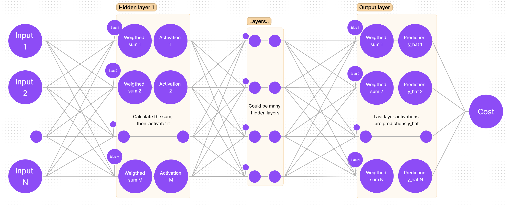
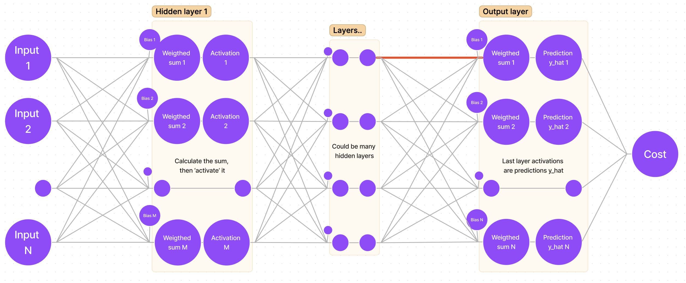
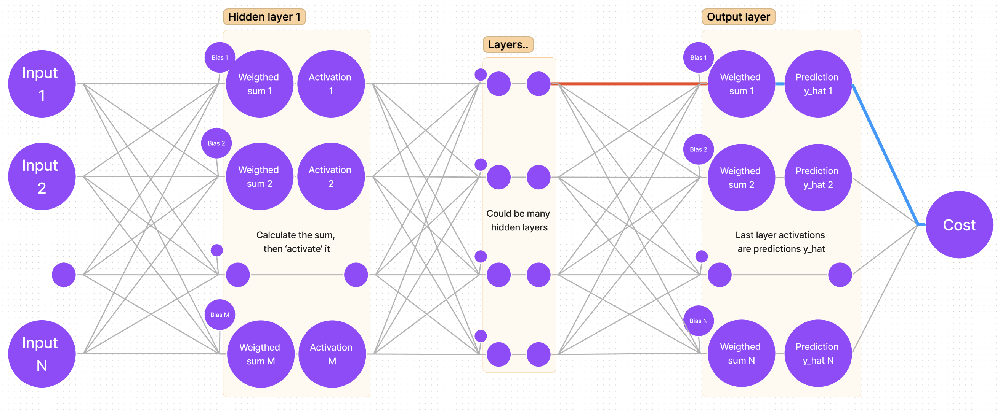
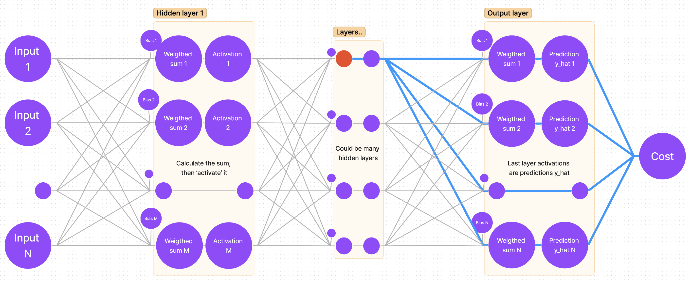

# Introductory to DNN
A neural network written in Python to solve XOR problem.

# Architecture
The dimensions of this neural network can be changed dynamically. For XOR problem it is sufficient to have 2 neurons in the input layer, 10 neurons in the hidden layer, and 2 neurons in the output layer (classes '0' and '1'). Dimensions are adjusted by this line of code:
```
# two input neurons, one hidden layer with 10 neurons, last layer with 2 output neurons
NN_dimensions = [2, 10, 2]

# a - number of inputs, Ln - number of neurons in hidden layers
NN_dimensions = [a, L1, L2, ..., Ln]
```

In this code example, the number of iterations is fixed, and the learning rate is fixed as well. This project was made with one purpose: delving into the essence of neural networks, that is, math.
# Notations used in formulas for gradient calculation:

Weight notation, where _(n)_ - layer index, _i_ - neuron index, _j_ - weight index:
```math
W_{ij}^{(n)}
```
Bias value, where _(n)_ - layer index, _i_ - neuron index:
```math
b_{i}^{(n)}
```
The _weighted sum_ value _z_ of a neuron, where _(n)_ - layer index, _i_ - neuron index:
```math
z_{i}^{(n)}
```
The activation value _a_ of a neuron, where _(n)_ - layer index, _i_ - neuron index:
```math
a_{i}^{(n)}
```
The predicted output for class _i_, where _i_ is the index of neuron in the last (output) layer:
```math
\hat{y_i} = a_i^{(lastLayer)} 
```
The expected output for class _i_, where _i_ is the index of neuron in the last (output) layer:
```math
y_i
```
The cost function of the whole neural network:
```math
C
```
# Calculations
The learning process is, in simple words, many repetitions of "moving" forward and calculating activation values, then going backward and adjusting weights and biases based on that. For the forward propagation, we use functions of _weighted sum_, _activation_ and _square error_. For backpropagation we have to find derivatives of _square error_ with respect to _activation_, then derivative of _activation_ with respect to _weighted sum_, and lastly derivative of _weighted sum_ with respect to _weight_.
## Sum, activation, and cost functions for forward propagation
As mentioned before, it is necessary to calculate the _sum_ values _z_ for every neuron in every hidden layer.
We use the formula as follows (_M_ - number of neurons in the previous layer):
```math
z_{i}^{(n)} = b_{i}^{(n)} + \sum_{k=1}^{M}(W_{ik}^{(n)}*a_k^{(n-1)})
```

The activation function of every neuron in this neural network is sigmoid.
It is calculated as follows:
```math
a_i^{(n)} = \frac{1}{1 + e^{(-z_i^{(n)})}}
```

The cost function used here is slightly different from MSE (Mean Square Error). Instead of taking the mean of all square errors, we take 1/2. This is done in order for the derivative to be a bit simpler.
MSE (or _C_) is calculated as follows:
```math
C = \frac{1}{2}*\sum_{k=1}^M(y_i - \hat{y_i})^2
```
## Derivatives and gradient - backpropagation
### Graphical visualization of applying the chain rule in the output layer
In order to calculate the gradient for each _weight_ we have to calculate the partial derivative of _cost_ with respect to that _weight_. I find it easier to think of this process as "finding the path that leads from _cost_ to that _weight_".

If we sketch our neural network, we get a generalized graph:



First things first, we want to adjust the weights for the output (last) layer (remember, we are starting from "the end"). It means that we are looking for:
```math
grad = \frac{\partial{C}}{\partial{W_{ij}}^{(n)}}
```
Suppose we are looking for the gradient for the first _weight_ of the first neuron. In the sketch, that _weight_ is marked with a bold red line:



I myself use an intuitive way for finding the derivative: follow the path from the cost function to that weight you are looking for (bold blue lines):



It is clear that we have to "traverse" through _cost-y_hat, then y_hat-sum_, and lastly _sum-weight_. That's the same as saying: find the partial derivative of _cost_ with respect to _y_hat_, then find the partial derivative of _y_hat_ with respect to _sum_, and finally the partial derivative of _sum_ with respect to _weight_.
### Mathematical approach and applying the chain rule for the output layer
So, if we are calculating gradients for the last layer _n_, by following the chain rule, we get the following equation:
```math
\frac{\partial{C}}{\partial{W_{ij}^{(n)}}} = \frac{\partial{C}}{\partial{\hat{y_i}^{(n)}}} * \frac{\partial{\hat{y_i}^{(n)}}}{\partial{{z_{i}^{(n)}}}}  * \frac{\partial{z_{i}^{(n)}}}{\partial{{W_{(ij)}^{(n)}}}}
```
In order to solve it, let's first find each derivative:
```math
\frac{\partial{C}}{\partial{\hat{y_i}^{(n)}}} = y_i - \hat{y_i}
```
```math
\frac{\partial{\hat{y_i}^{(n)}}}{\partial{{z_{i}^{(n)}}}} = \hat{y_i} * (1 - \hat{y_i})
```
```math
\frac{\partial{z_{i}^{(n)}}}{\partial{{W_{(ij)}^{(n)}}}} = a_j^{(n-1)}
```
Putting it all back together, we get the full gradient:
```math
grad = \frac{\partial{C}}{\partial{W_{ij}^{(n)}}} = (y_i - \hat{y_i}) * \hat{y_i} * (1 - \hat{y_i}) * a_j^{(n-1)}
```
If we want to adjust the bias, then the partial derivative of _sum_ with respect to bias is 1; we get:
```math
grad = \frac{\partial{C}}{\partial{b_{i}^{(n)}}} = (y_i - \hat{y_i}) * (\hat{y_i} * (1 - \hat{y_i}))
```
That's it! Having found the gradient for each weight in the output layer, we can use it to adjust the weights:
```math
W_{ij}^{(n)} := W_{ij}^{(n)} - grad * learningRate
```
### Graphical visualization of the chain rule for hidden layers
Now the harder part is calculating the gradient for hidden layers. Luckily, there is a pattern for calculating the derivatives, as some of them repeat themselves in different layers' equations. To acknowledge that pattern, we must not calculate the derivative of _cost_ with respect to _weight_, but find the partial derivative of _cost_ with respect to _sum_ (this way we will be able to save that derivative value and use it later).

Let's once again mark the _sum_  of a hidden layer with the color red:


Now let's find all paths from _cost_ to that _sum_:



It is clear that there's more than one path, but that's quite easy to account for - the calculation is done by adding all partial derivatives that we get "traversing each path"!
### Mathematical approach and applying chain rule for hidden layers
There's one unresolved question: why take the derivatives of _cost_ with respect to _sum_ and not with respect to _weight_? As we will soon find out, there is a pattern: derivatives repeat themselves, hence calculating and saving derivatives as we move from the outer layer (BACK propagation) to 'front' enables us to reuse the values (note: remember what I said about "traversing all paths" and adding them up? That's where the _summation sign_ comes from; _M_ - number of neurons in the next (n+1) layer):
```math
\frac{\partial{C}}{\partial{{z_i^{(n)}}}} = \sum_{k=1}^{M}\frac{\partial{C}}{\partial{a_k^{(n+1)}}} * \frac{\partial{a_k^{(n + 1)}}}{\partial{z_k^{(n+1)}}} * \frac{\partial{z_k^{(n+1)}}}{\partial{{a_i^{(n)}}}} * \frac{\partial{a_i^{(n)}}}{\partial{{z_{i}^{(n)}}}} 
```
Note how the last derivative is constant in terms of _k_ (that value is the same for every member in the _summation_), so we can put it before the _summation sign_. Also note, that we have two partial derivatives that can be rewritten as one:
```math
\frac{\partial{C}}{\partial{a_k^{(n+1)}}} * \frac{\partial{a_k^{(n + 1)}}}{\partial{z_k^{(n+1)}}} = \frac{\partial{C}}{\partial{z_k^{(n+1)}}}
```
We get:
```math
\frac{\partial{C}}{\partial{{z_i^{(n)}}}} = \frac{\partial{a_i^{(n)}}}{\partial{{z_{i}^{(n)}}}} * \sum_{k=1}^{M}\frac{\partial{C}}{\partial{z_k^{(n+1)}}} * \frac{\partial{z_k^{(n+1)}}}{\partial{{a_i^{(n)}}}}
```
Calculate derivatives that we can find:
```math
\frac{\partial{a_i^{(n)}}}{\partial{{z_{i}^{(n)}}}} = a_i^{(n)} * (1 - a_i^{(n)})\quad\quad and \quad\quad\frac{\partial{z_k^{(n+1)}}}{\partial{{a_i^{(n)}}}} = W_{ki}^{(n+1)}
```
Plug the values back into the equation:
```math
\frac{\partial{C}}{\partial{{z_i^{(n)}}}} = a_i^{(n)} * (1 - a_i^{(n)}) * \sum_{k=1}^{M}\frac{\partial{C}}{\partial{z_k^{(n+1)}}} * W_{ki}^{(n+1)}
```
Notice how for the cost derivative with respect to _sum_ in layer _n_ we have to use the cost derivative with respect to _sum_ in layer _(n+1)_. That's the most important part of making the code work - saving the derivatives. 
## Gradient descent, general expressions, and round-up
Now we know everything we need to know to use the gradient descent algorithm. Let's sum up really quickly and get to coding!
### General expressions for finding derivatives
As the most important part of the program is saving partial derivatives of _cost_ with respect to each layer's _sum_, let's write it in a nice and concise way.

Derivative for the last layer:
```math
\frac{\partial{C}}{\partial{{z_{i}^{(lastLayer)}}}} = (y_i - \hat{y_i}) * \hat{y_i} * (1 - \hat{y_i})
```
The general expression for any hidden layer:
```math
\frac{\partial{C}}{\partial{{z_i^{(n)}}}} = a_i^{(n)} * (1 - a_i^{(n)}) * \sum_{k=1}^{M}\frac{\partial{C}}{\partial{z_k^{(n+1)}}} * W_{ki}^{(n+1)}
```
### General expressions for finding gradients
Once we have calculated all derivatives, we can adjust the weights by calculating the full gradient and subtracting it from that weight. Here we have two general formulas. First one for adjusting any weight:
```math
grad_{ij}^{(n)} = \frac{\partial{C}}{\partial{W_{ij}^{(n)}}} = \frac{\partial{C}}{\partial{z_{i}^{(n)}}} * \frac{\partial{z_{i}^{(n)}}}{\partial{W_{ij}^{(n)}}} = \frac{\partial{C}}{\partial{{z_{i}^{(n)}}}} * a_j^{(n-1)}
```
And a second one for adjusting the _bias_ value (optionally: add _a<sub>0</sub> = 1_ to your activations array and use the previous formula):
```math
grad_{ij}^{(n)} = \frac{\partial{C}}{\partial{b_i^{(n)}}} = \frac{\partial{C}}{\partial{z_{i}^{(n)}}} * 1 = \frac{\partial{C}}{\partial{z_{i}^{(n)}}}
```
Finally, we get a really neat and clean _weight_ adjustment equation:
```math
W_{ij}^{(n)} := W_{ij}^{(n)} - grad_{ij}^{(n)} * learningRate
```
